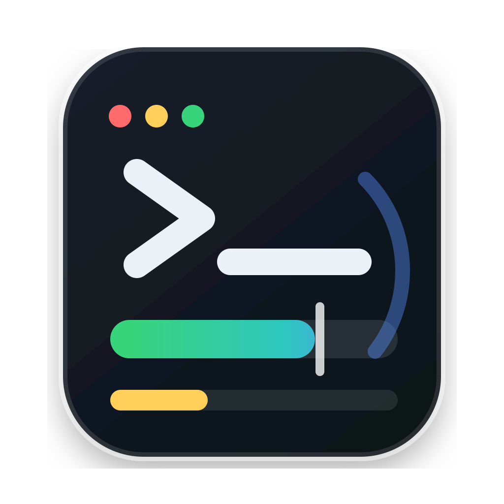

<p align="center">
  
</p>

<h1 align="center">CodexUsage</h1>

CodexUsage는 Codex 사용량을 퍼센트와 막대로 보여주는 macOS 메뉴바 앱입니다.

English README: [README.md](README.md) · [최신 DMG 다운로드](https://github.com/Wordbe/codex-usage/releases/latest/download/CodexUsage.dmg) · [MIT License](LICENSE)

## 다운로드 및 설치

1. 최신 [CodexUsage.dmg](https://github.com/Wordbe/codex-usage/releases/latest/download/CodexUsage.dmg)를 다운로드합니다.
2. DMG를 엽니다.
3. DMG 안의 `READ BEFORE INSTALL - Open Anyway Guide.txt`를 먼저 읽습니다.
4. `CodexUsage.app`을 더블클릭합니다.

macOS가 `"CodexUsage" Not Opened`를 보여주면 **시스템 설정 > 개인정보 보호 및 보안**에서 CodexUsage의 **그래도 열기**를 누르고 `CodexUsage.app`을 다시 더블클릭하세요.

DMG에서 처음 실행하면 CodexUsage가 스스로 `~/Applications/CodexUsage.app`로 복사되고 설치된 앱을 실행합니다. 로그인 항목을 만들고 CLI를 `~/.codexusage/bin/codexusage`에 연결합니다.

CodexUsage는 Codex `config.toml`이나 Codex status line을 수정하지 않습니다.

## 오픈소스

CodexUsage는 [MIT License](LICENSE)로 공개된 오픈소스 프로젝트입니다.

저장소에는 다음이 포함됩니다.

- macOS 메뉴바 앱의 Swift 소스 코드
- DMG 빌드 및 GitHub 릴리즈 스크립트
- SVG 제품 아이콘: [docs/assets/codexusage-icon.svg](docs/assets/codexusage-icon.svg)
- 영어/한국어 설치 문서
- DMG에서 앱 더블클릭만으로 설치되는 self-install 동작

이슈와 Pull Request는 [Wordbe/codex-usage](https://github.com/Wordbe/codex-usage)에서 받을 수 있습니다.

보안 문제는 공개 이슈 대신 비공개로 제보해주세요. [SECURITY.md](SECURITY.md)를 참고하세요.

## CLI

```bash
~/.codexusage/bin/codexusage status
~/.codexusage/bin/codexusage status --json
~/.codexusage/bin/codexusage status --refresh
~/.codexusage/bin/codexusage status --diagnose
```

GUI 앱이 Codex를 찾지 못하면 다음을 설정하세요.

```bash
export CODEXUSAGE_CODEX_PATH="$(command -v codex)"
```

## 데이터와 동기화

CodexUsage는 먼저 Codex `/status`가 사용하는 세션 rate-limit 이벤트를 읽습니다.

```text
~/.codex/sessions/**/*.jsonl
event_msg.payload.rate_limits.primary.used_percent
```

현재 세션 이벤트가 없으면 다음 Codex app-server API를 사용합니다.

```text
codex app-server --stdio
account/rateLimits/read
rateLimitsByLimitId.codex.primary.usedPercent
```

앱은 5시간 Codex 사용량을 표시합니다. 캐시는 `~/.codexusage/cache/rate-limits.json`에 저장됩니다.

정책:

- 앱은 60초마다 동기화합니다.
- 캐시 TTL은 30초입니다.
- `status --refresh`는 새 동기화를 강제합니다.
- `status --diagnose`는 app-server, cache, 최신 Codex session 이벤트를 비교합니다.
